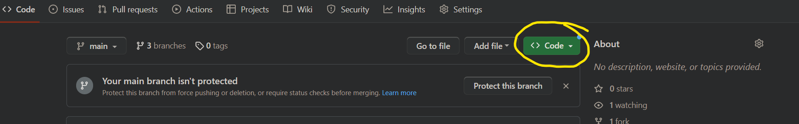
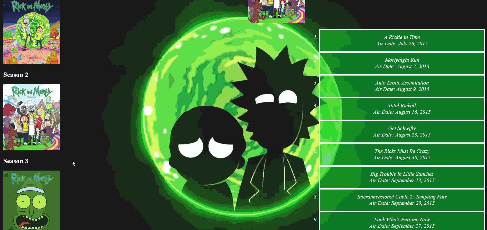
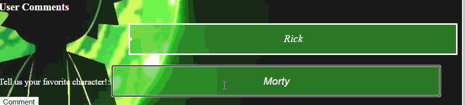
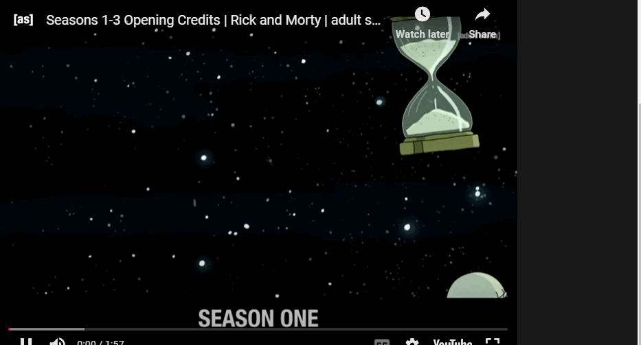

# PROJECT OVERVIEW
CALLING ALL RICK N' MORTY LOVERS! 

"PROJECT RICK" highlights the infamous TV series "Rick n' Morty". 

The purpose is to pay homage to and showcase the first 5 seasons episodes, and put on display all your beloved characters! 

 

# INSTALLATION INSTRUCTIONS

Step 1: Visit https://github.com/salvat36/project-1 and select "CODE"

Step 2: Copy SSH Link 

Step 3: Clone in your local repository using git clone ["paste SSH link here"]

Step 4: Type command "cd project-1" in your terminal to access the project's directory

Step 5: Type command "code ." to open up the project in your preferred text editor

Step 6: Once your text editor is open, next step is to start your "json server" locally. To do that, you can type "json-server --watch db.json" in either your text editor or command-line interface terminal

Step 7: To access "PROJECT RICK" in a browser, 

-For MAC users: type the command "open index.html" in the terminal
-For Windows users: type the command "explorer.exe index.html" in the terminal

 

# PROJECT RICK USAGE

Our project provides various features and functionality including:

-You can click on an individual season's image to display a full list of corresponding episodes

-You can access the show's list of characters from a drop-down menu and see a detailed image of the selected character

-You will be able to submit your favorite character using a form and have it shown in the comments section

-For those who would like to, you can play the TV show's theme song while using the application

 

# CONTRIBUTE
If you or your friends would like to contribute to our project, please submit bug reports, feature requests, or pull requests to the following e-mail address: 

projectrick@example.com
 

# LICENSING 
MIT License

Copyright (c) [2023] [Ryan Salvato, Joseph Stewart, Kevin Lumauig]

Permission is hereby granted, free of charge, to any person obtaining a copy
of this software and associated documentation files (the "Software"), to deal
in the Software without restriction, including without limitation the rights
to use, copy, modify, merge, publish, distribute, sublicense, and/or sell
copies of the Software, and to permit persons to whom the Software is
furnished to do so, subject to the following conditions:

The above copyright notice and this permission notice shall be included in all
copies or substantial portions of the Software.

THE SOFTWARE IS PROVIDED "AS IS", WITHOUT WARRANTY OF ANY KIND, EXPRESS OR
IMPLIED, INCLUDING BUT NOT LIMITED TO THE WARRANTIES OF MERCHANTABILITY,
FITNESS FOR A PARTICULAR PURPOSE AND NONINFRINGEMENT. IN NO EVENT SHALL THE
AUTHORS OR COPYRIGHT HOLDERS BE LIABLE FOR ANY CLAIM, DAMAGES OR OTHER
LIABILITY, WHETHER IN AN ACTION OF CONTRACT, TORT OR OTHERWISE, ARISING FROM,
OUT OF OR IN CONNECTION WITH THE SOFTWARE OR THE USE OR OTHER DEALINGS IN THE
SOFTWARE.
 

# CONTACT INFORMATION
rjk@example.com

If you have any questions or feedback, feel free to reach out

 
# ACKNOWLEDGMENTS
Created by: 
Ryan Salvato
Joseph Stewart
Kevin Lumauig

API key provided by: https://rickandmortyapi.com

Images provided by:
https://rickandmorty.fandom.com/wiki/
